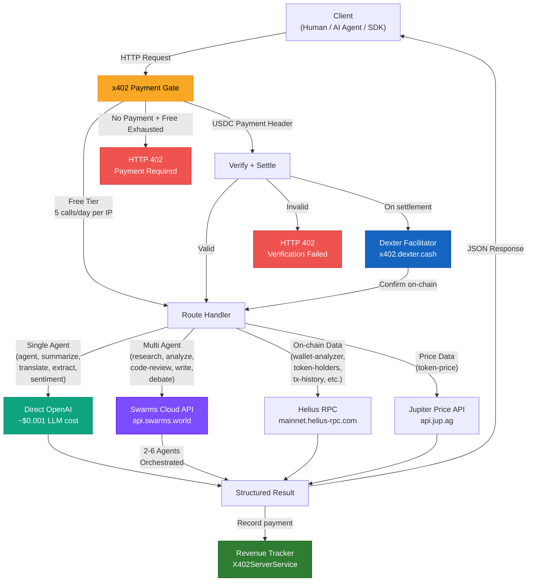
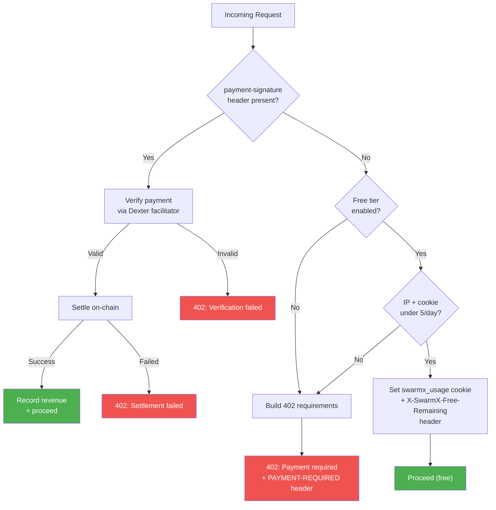
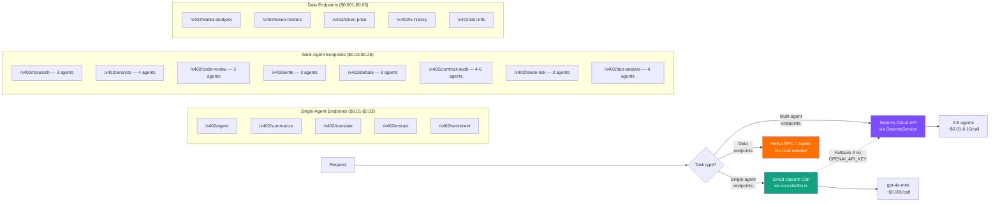
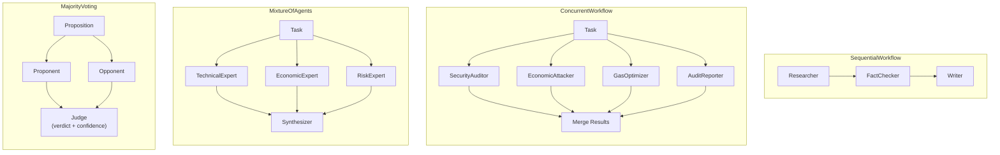
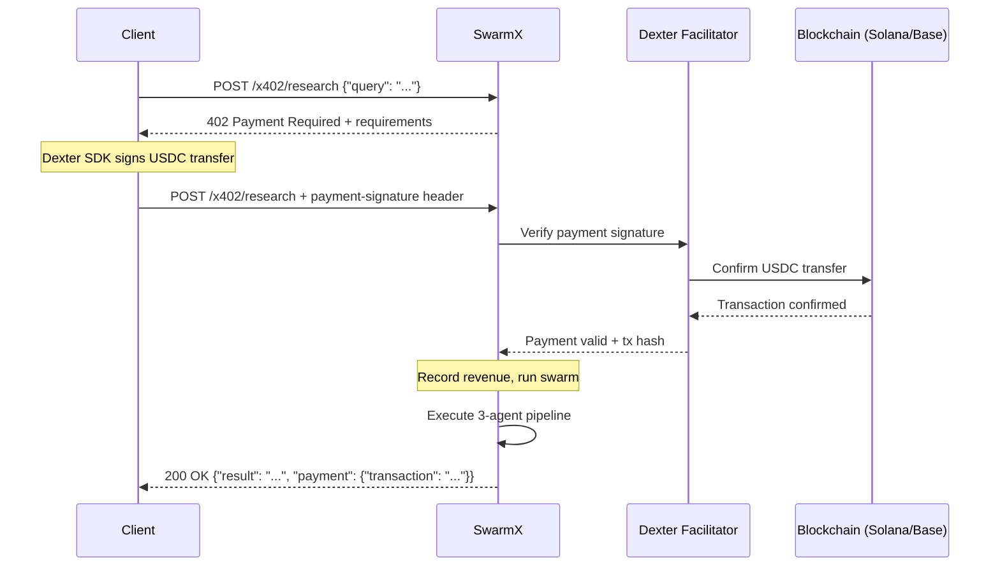
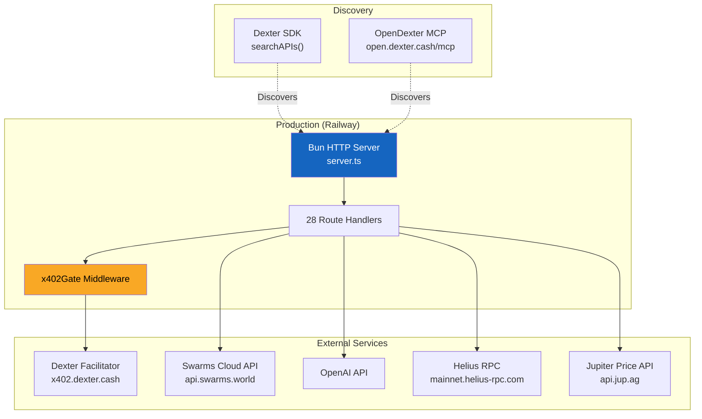

# SwarmX Platform Architecture

Visual architecture of the SwarmX platform -- how requests flow from client to response, how payments work, and how LLM routing is decided.

## Request Flow

## Payment Gate Detail

## LLM Routing Strategy

## Swarm Architecture Patterns

SwarmX uses four orchestration patterns depending on the endpoint:

| Pattern | Used By | How It Works |
|---------|---------|--------------|
| SequentialWorkflow | research, write, token-risk | Agents run in order; each builds on the previous agent's output |
| ConcurrentWorkflow | code-review, contract-audit | Agents run in parallel; results are merged |
| MixtureOfAgents | analyze, dao-analyze | Domain experts run in parallel, then a synthesizer combines |
| MajorityVoting | debate | Pro/con agents argue, a judge delivers the verdict |

## Revenue Flow

## Deployment Architecture

### Environment Variables

| Variable | Required | Description |
|----------|----------|-------------|
| `X402_RECEIVE_ADDRESS` | Yes (sell-side) | Wallet address to receive USDC payments |
| `X402_NETWORK_ID` | No | Default: `base-mainnet`. Supported: `solana-mainnet`, `base-mainnet`, `ethereum-mainnet`, `polygon-mainnet`, `arbitrum-mainnet` |
| `SWARMS_API_KEY` | Yes (multi-agent) | Swarms cloud API key for multi-agent orchestration |
| `OPENAI_API_KEY` | Yes (single-agent) | Direct OpenAI calls for single-agent endpoints |
| `HELIUS_API_KEY` | Yes (data endpoints) | Helius RPC access for on-chain data |
| `SOLANA_PRIVATE_KEY` | Yes (buy-side) | Wallet key for making x402 payments (client-side) |
| `EVM_PRIVATE_KEY` | Alt (buy-side) | EVM wallet key for Base/Polygon/Arbitrum payments |
| `X402_BUDGET_USD` | No | Total budget cap (default: `10.00`) |
| `X402_MAX_AUTO_PAY_USD` | No | Max per-request payment (default: `0.10`) |
| `X402_ACCESS_PASS_TIER` | No | Access pass tier: `24h`, `7d`, or `30d` |
